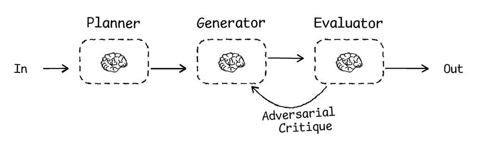

# enso

> Intelligence lives in the model. Control lives in the runtime and harness. Continuity lives in the substrate.

**enso is a seam-oriented harness protocol for agentic work.**

Every boundary where behavior changes hands—planning to execution, agent to capability, stance to protocol—is a seam. Most systems treat those boundaries as afterthoughts. enso treats them as first-class: each seam has an **interface** (the contract) and an **enabling point** (where you swap the driver). That separation is what makes agent systems inspectable, composable, and compounding over time.

Drop `AGENTS.md` into your repo and you bootstrap a **harness instance**—a persistent, project-local orchestration surface that turns ephemeral agent sessions into verifiable, recursive workflows.

```bash
curl -o AGENTS.md https://raw.githubusercontent.com/usefulmove/enso/main/AGENTS.md
```

One file. No dependencies. No CLI. Your agent becomes a more disciplined engineer.

---

## The Problem

If you code with agents, you know this fatigue.

You explain the architecture to an agent that *built* it three sessions ago. You find bugs reintroduced because last week's lesson evaporated. You watch a brilliant model behave like an amnesiac—writing code that contradicts its own conventions, touching files it promised to avoid, treating every task like opening night with no rehearsal.

The model is not the problem. The model is magnificent. The problem is that **decisions vanish at the seams**—the boundaries where one behavior hands off to another. Planning collapses into execution without review. An agent's stance leaks into its protocol. Capabilities are hard-coded instead of discovered. Without explicit contracts at each boundary, every session starts cold and coherence decays.

An **orchestration surface** is the persistent, inspectable contract layer between a human and a swarm of agents—and between the agents themselves. Without it, decisions vanish, lessons evaporate, and the human becomes the memory system. That doesn't scale.

---

## The Solution: The Surface

An agent *harness* is everything between user intent and model output that is *not* the language model itself—runtime behavior, context assembly, tool orchestration, verification loops, feedback mechanisms, and lifecycle management.

The harness is the 80% factor in agent reliability. Same model, better harness, dramatically better results.

| Evidence | Result |
|----------|--------|
| **Vercel** agent evals | Persistent context via AGENTS.md achieved a **100% pass rate** vs. **79%** for on-demand skill retrieval—a +21 percentage point improvement ([source](https://vercel.com/blog/agents-md-outperforms-skills-in-our-agent-evals)) |
| **LangChain** Terminal Bench 2.0 | Same model (Claude Opus 4.6), different harness: improved from **Top 30 to Top 5** by optimizing the harness alone ([source](https://blog.langchain.dev/the-anatomy-of-an-agent-harness/)) |

> *"The model contains the intelligence. The harness makes that intelligence useful."* — LangChain

**Enso is the harness that makes the surface deterministic, inspectable, and compounding.** File-based truth replaces vector-database drift. Context lives in verified architecture docs and explicit cross-package state, session over session. It is a way to make that harness explicit, durable, and project-local.

---

## The Seams

| Seam | Interface | Enabling Point |
|:---|:---|:---|
| **Planning → Execution** | Story template (Goal, AC, Approach, Verification) | The story document—reviewed before code is touched |
| **Ephemeral → Persistent** | Six operations: Write, Select, Probe, Compress, Isolate, Assign | The agent's explicit invocation |
| **Agent → Codebase** | Context Scope (Write / Read / Exclude) | The scoped file list loaded at runtime |
| **Agent → Capability** | `SKILL.md` frontmatter | The scripts in `docs/skills/<name>/` |
| **Stance → Protocol** | `SOUL.md` / `AGENTS.md` dual-document structure | Which persona files are injected into the harness at runtime |

Every interface is a language. enso's vocabulary is its seam graph.

### Seams in practice

**Capabilities.** Look at `docs/skills/<name>/`:

The agent reads `SKILL.md` to discover what this slot does. The shell script does the work. The script can be rewritten in Python or replaced with a different backend—without changing how the agent discovers or routes to it. The contract is stable. The implementation moves.

**Stance vs. protocol.** When a human-facing agent needs to shift between a debugging session and a reflective conversation, the surface doesn't rewrite its identity. The interface is the dual-document structure (`SOUL.md` for stance, `AGENTS.md` for protocol). The enabling point is which files get injected into the harness. Technical work gets precision; personal weight gets presence. Same surface, different register.

---

## The Canonical Stack

Enso works by separating what reasons, what executes, what governs, what persists, and what gets changed. The surface lives in the middle—the contract layer that coordinates across seams.

| Layer | What it is | Example |
|-------|------------|---------|
| **Model** | The LLM that reasons and generates output | GPT, Claude, Gemini |
| **Runtime** | The executable host that runs loops and dispatches tools | OpenCode, Claude Code, Cursor, Codex |
| **Harness protocol** | The rules, schema, and workflow for disciplined agent work | `enso` |
| **Harness instance** | A project-local realization of the protocol—the surface installed in your repo | `AGENTS.md`, `docs/`, `skills/`, `logs/` |
| **Agent instantiation** | One ephemeral task process running inside the runtime | the current session or task |
| **Substrate** | The durable environment being read and transformed | codebase, docs, configs, repo state |

- the **model** reasons
- the **runtime** executes
- the **harness protocol** defines how work should happen
- the **harness instance** is that protocol installed in a specific project—this is the surface
- the **agent instantiation** is the current ephemeral worker
- the **substrate** is the durable environment being transformed

### What Persists—and What Doesn't

Agent instantiations are ephemeral. They start, do work, and disappear.

Harness instances and substrates persist.

That distinction is the whole game. Without a persistent harness instance attached to a persistent substrate, every agent run starts cold. Decisions vanish. Lessons evaporate. The human becomes the memory system.

Enso fixes that by giving each agent instantiation a durable project context to read from and write back to.

---

## The Execution Loop

The surface becomes executable when work moves through an explicit role loop:



The **Planner** turns intent into a story contract: goal, scope, acceptance criteria, and verification. The **Generator** implements only inside the story's declared write scope. The **Evaluator** checks the result against the frozen contract and evidence. The **Human** approves plans, accepts results, requests revisions, or blocks unsafe transitions.

The substrate for that loop is a live story file. `STORY-000` is reserved for the [`enso.story/v1` specification](docs/reference/STORY.md); live stories such as `STORY-001+` conform to that spec and carry the current state, role outputs, verification evidence, and transition history for one unit of work.

This planner-generator-evaluator pattern is one concrete execution model for enso, not a requirement that every runtime implement it the same way. The strict pi version is documented in [`docs/reference/hitl-pge-loop-design.md`](docs/reference/hitl-pge-loop-design.md).

---

## Quick Start

### 1. Plant the Seed

```bash
curl -o AGENTS.md https://raw.githubusercontent.com/usefulmove/enso/main/AGENTS.md
```

`AGENTS.md` is not just documentation—it is the seed of the harness protocol inside your repo. Once bootstrapped, it becomes part of a project-local harness instance that future agent instantiations can reuse. Without it, the protocol disappears between runs.

### 2. Activate

Paste exactly this into your agent:

| Tool | Prompt |
|------|--------|
| **Claude Code** | `/read AGENTS.md` then `/project "Bootstrap this project using the enso protocol."` |
| **Cursor** | `@AGENTS.md` in chat, then type `Bootstrap this project with enso.` |
| **OpenCode** | `Read @AGENTS.md and bootstrap this project.` |
| **Pi** | Run `pi` in the repo, then type: `Bootstrap this project with enso.` |

### 3. Watch It Grow

**00:00** — `> Read @AGENTS.md and bootstrap this project.`  
**00:03** — `Bootstrapping docs/ structure...`  
**00:08** — `Probing codebase—found 14 source files, 2 test suites.`  
**00:18** — `Mapping architecture...`  
**00:35** — `Drafting PRD.md and ARCHITECTURE.md.`  
**00:52** — `First story template ready at docs/stories/STORY-001.md.`  
**00:59** — `Harness instance active. What should we build first?`

From there, the cycle repeats: plan, execute, capture, extend. Each session leaves the harness instance sharper than the last.

---

## How It Works

Each agent instantiation runs inside a runtime, follows the enso protocol, and operates against the same substrate through the project's harness instance. The surface is the contract layer that coordinates human intent, agent specialization, and execution.

### The Six Operations

The context window is a spotlight—you can illuminate only so much at once. Six operations control what's lit, what's just off-stage, and when to change scenes.

| Operation | Action |
|-----------|--------|
| **Write** | Persist insights to disk |
| **Select** | Load only what's needed now |
| **Probe** | Search actively—don't assume, discover |
| **Compress** | Summarize to fit the token budget |
| **Isolate** | Split work across scopes |
| **Assign** | Match task to the right agent |

### The Directory Structure

Enso creates a standard, predictable structure that becomes part of the project's harness instance:

```
docs/
  core/           # Source of truth—PRD, Architecture
  stories/        # Active units of work
  reference/      # Long-term memory—lessons, conventions
  skills/         # Self-authored tools and capabilities
  logs/           # Session history
```

**Core** holds the source of truth. **Stories** hold active scoped work. **Reference** holds earned knowledge. **Skills** hold self-authored capabilities. **Logs** hold compressed session memory.

### The Self-Extension Loop

Enso draws from the [Pi Principle](https://github.com/badlogic/pi-mono/): **agents extend themselves by authoring tools, not downloading them.**

When an agent encounters friction—a repetitive task, a complex procedure, a missing capability—it doesn't wait. It builds the minimal tool, persists it to `docs/skills/`, and moves on. Those capabilities become part of the harness instance, and future agent instantiations inherit them automatically. Later sessions refine them.

The Pi Principle lives at the **agent → capability** seam. When an agent hits friction, it doesn't rewrite its system prompt—it authors a tool where the contract (`SKILL.md`) stays stable and the driver (the script) can evolve. The compounding effect: a tool built today saves derivation cost in every future session. After months of work, an agent has dozens of custom tools tailored to its codebase—not downloaded dependencies, but authored capabilities. Software that builds software.

> *"The most powerful agents are not those with the most downloaded dependencies, but those that have built the most custom tools for their specific workflows."*

---

## Core Principles

Enso treats context as a scarce resource. Every token competes for attention. Three principles govern the protocol:

- **Separate concerns.** Working context is ephemeral, persistent context survives sessions, and reference context is retrieved on demand.
- **Progressive disclosure.** Load only what you need, when you need it. Summaries before details. Search before assuming.
- **Stay current, not historical.** Documents reflect the present state. Git tracks history. Docs don't accumulate cruft.

---

## Key Capabilities

| Capability | Payoff |
|------------|--------|
| **Plan-before-execute** | No file changes without a verified story |
| **Context scope** | Explicit Write/Read/Exclude boundaries on every task |
| **Retrieval-led reasoning** | Version-matched docs in `docs/` instead of stale training data |
| **Agentic discovery** | Agents probe the codebase and build a mental map before talking to you |
| **Institutional memory** | Lessons and anti-patterns captured in `LESSONS.md`, preventing repeat mistakes |
| **Self-extending agents** | Capabilities compound over time—the agent becomes uniquely capable for its domain |
| **Multi-agent surface** | Specialists (Planner, Generator, Evaluator, Curator) activated by the Assign operation and coordinated through shared story state |

---

## What Enso Is

- **A file-based protocol.** It lives in your repo, not as a dependency.
- **A contract language.** It defines interfaces at seams, not a runtime that executes them.
- **Model-agnostic.** Works with any agentic runtime that can read files and follow instructions.
- **Adaptable.** The protocol is a starting point. Adapt it to your codebase, your workflow, your domain.

## What Enso Is Not

- **Not a model.** Enso does not generate tokens or do reasoning.
- **Not a runtime.** It does not host execution loops or dispatch tools by itself.
- **Not a CLI or library.** There's nothing heavyweight to install or maintain.
- **Not rigid.** You modify the protocol for your domain; the protocol doesn't modify you.

---

## References

- **Pi Principle** — Agents extend themselves by authoring tools. [pi-mono](https://github.com/badlogic/pi-mono/)
- **Story State Spec** — `STORY-000`, the canonical `enso.story/v1` contract for live story instances. [`docs/reference/STORY.md`](docs/reference/STORY.md)
- **HITL PGE Loop Design** — Strict planner-generator-evaluator loop over live story state. [`docs/reference/hitl-pge-loop-design.md`](docs/reference/hitl-pge-loop-design.md)
- **Sisyphus Orchestration Loop** — Multi-step task execution with verification gates. [oh-my-opencode ecosystem](https://github.com/topics/sisyphus)
- **Agentic Context Engineering** — Research on context management for AI agents. [arXiv:2510.04618](https://arxiv.org/pdf/2510.04618)
- **Vercel Agent Evals** — Persistent context via AGENTS.md achieved 100% pass rate vs. 79% for skill retrieval. [Blog](https://vercel.com/blog/agents-md-outperforms-skills-in-our-agent-evals)
- **LangChain Terminal Bench 2.0** — Harness optimization improved agent ranking from Top 30 to Top 5. [Blog](https://blog.langchain.dev/the-anatomy-of-an-agent-harness/)

## License

MIT
