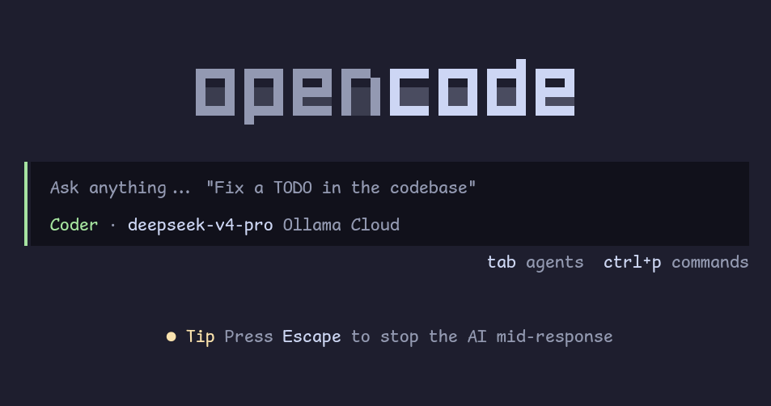

# enso



**The emacs of agent orchestrators.** Software that builds software.

Enso is a single markdown file (`AGENTS.md`) that turns any AI coding agent into a disciplined software engineer. Drop it into a repo, tell the agent to read it, and watch it bootstrap a full context management system from one seed. No dependencies. No CLI. No SaaS. One file that grows.

> Intelligence is in the model. Control is in the harness.

## The Problem

AI agents are powerful. They are also forgetful, overconfident, and careless.

- They forget patterns established two sessions ago.
- They hallucinate details they could have searched for.
- They write code that conflicts with the architecture.
- They lose lessons learned between sessions.
- They touch files they shouldn't, miss files they should, and treat every task like the first time.

This is **context rot** — the slow decay of coherence as an agent loses track of what it knows, what it's done, and what it's supposed to be doing. The model isn't the bottleneck. The context is.

## The Solution: Harness Engineering

An agent harness is everything between user intent and model output that is *not* the language model itself — context assembly, tool orchestration, verification loops, feedback mechanisms, and lifecycle management.

The harness is the 80% factor in agent reliability. Same model, better harness, dramatically better results.

| Evidence | Result |
|----------|--------|
| **Vercel** agent evals | Persistent context via AGENTS.md achieved a **100% pass rate** vs. **79%** for on-demand skill retrieval — a +21 percentage point improvement ([source](https://vercel.com/blog/agents-md-outperforms-skills-in-our-agent-evals)) |
| **LangChain** Terminal Bench 2.0 | Same model (Claude Opus 4.6), different harness: improved from **Top 30 to Top 5** by optimizing the harness alone ([source](https://blog.langchain.dev/the-anatomy-of-an-agent-harness/)) |

> *"Agent = Model + Harness. The model contains the intelligence; the harness makes that intelligence useful."* — LangChain

Enso treats context as a scarce resource. Every token competes for attention. Three principles govern the protocol:

1. **Separate concerns.** Working context (ephemeral thought), persistent context (durable docs that survive sessions), and reference context (codebase and external sources searched on demand).
2. **Progressive disclosure.** Load only what you need, when you need it. Summaries before details. Search before assuming.
3. **Stay current, not historical.** Documents reflect the present state. Git tracks history. Docs don't accumulate cruft.

## How It Works

### The Six Operations

The context window is a spotlight — you can illuminate only so much at once. Six operations control what's lit, what's just off-stage, and when to change scenes.

| Operation | Action | Why |
|-----------|--------|-----|
| **Write** | Persist insights to disk | Working memory is temporary; persistence survives sessions |
| **Select** | Load only what's needed now | Don't waste tokens on irrelevant context |
| **Probe** | Search actively (grep, LSP, glob) | Don't assume — discover |
| **Compress** | Summarize to fit the token budget | Condense instead of dropping |
| **Isolate** | Split work across scopes | Divide complex tasks to stay within limits |
| **Assign** | Match task to the right agent | Not every hand suits every clay |

### The Directory Structure

Enso creates a standard, predictable hierarchy that agents can navigate without guidance:

```
docs/
  core/           # Source of truth — PRD, Architecture
  stories/        # Active units of work
  reference/      # Long-term memory — lessons, conventions
  skills/         # Self-authored tools and capabilities
  logs/           # Session history
```

**Core** holds the vision — updated in place, never duplicated. **Stories** hold active work — each one scoped, planned, and verified before execution begins. **Reference** holds earned knowledge — completed work and the living `LESSONS.md` where every hard-won insight is recorded. **Skills** hold self-authored tools. **Logs** hold compressed session summaries.

### The Self-Extension Loop

Enso draws from the [Pi Principle](https://github.com/badlogic/pi-mono/): **agents extend themselves by authoring tools, not downloading them.**

When an agent encounters friction — a repetitive task, a complex procedure, a missing capability — it doesn't wait. It builds the minimal tool, persists it to `docs/skills/`, and moves on. The next session inherits the capability. The session after that refines it.

The compounding effect: a tool built today saves derivation cost in every future session. After months of work, an agent has dozens of custom tools tailored to its codebase — not downloaded dependencies, but authored capabilities. Software building software.

> *"The most powerful agents are not those with the most downloaded dependencies, but those that have built the most custom tools for their specific workflows."*

## Key Capabilities

- **Plan-before-execute.** Agents create a story with Steps, Risks, and Verification before modifying any file. Planning is not optional — it is the first act of execution.
- **Context scope.** Every story declares explicit Write/Read/Exclude file boundaries. No modifications outside declared scope without approval.
- **Retrieval-led reasoning.** Agents consult version-matched documentation in `docs/` instead of relying on stale training data. Deterministic, file-based RAG — low latency, high accuracy.
- **Agentic discovery.** Agents don't ask "what is this project?" They probe the codebase, read configs, and build a mental map before talking to you. Architecture docs are maps drawn through exploration, not blueprints to read.
- **Institutional memory.** Lessons and anti-patterns are captured in `LESSONS.md`, preventing repeat mistakes across sessions.
- **Self-extending agents.** Capabilities compound over time. The agent becomes uniquely capable for its specific domain.

## Quick Start

### 1. Plant the Seed

```bash
curl -o AGENTS.md https://raw.githubusercontent.com/usefulmove/enso/main/AGENTS.md
```

### 2. Activate

Point your agent (OpenCode, Cursor, Claude Code, Windsurf) to the file:

> "Read @AGENTS.md and bootstrap this project."

### 3. Grow

The agent will:
1. **Bootstrap** the `docs/` directory structure
2. **Probe** your codebase to map the architecture
3. **Draft** your `PRD.md` and `ARCHITECTURE.md`
4. **Align** with you on the first unit of work

From there, the cycle repeats: plan, execute, capture, extend. Each session leaves the harness sharper than the last.

## What Enso Is Not

- **Not a CLI or library.** It's a protocol — a single markdown file that any agent can read.
- **Not a framework.** There's nothing to install, configure, or maintain. Drop a file, start working.
- **Not model-specific.** It works with any agent that can read a file and follow instructions.
- **Not rigid.** The protocol is a starting point. Adapt it to your codebase, your workflow, your domain.

## License

MIT
