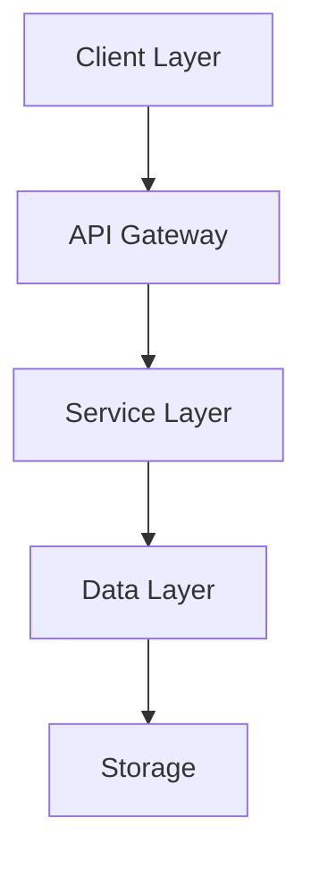
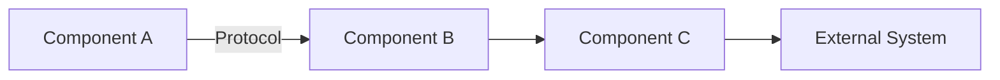
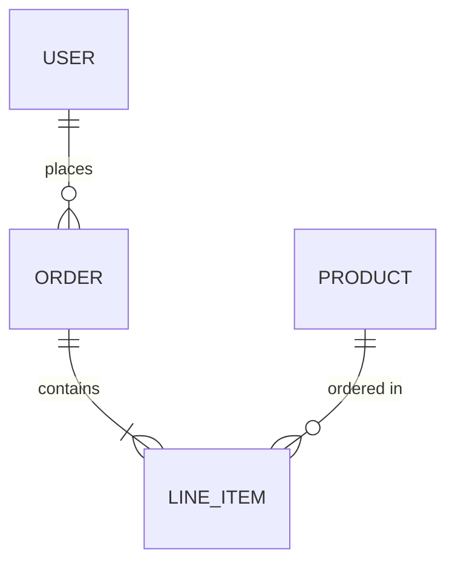
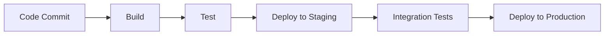

# Architecture Document

> **Note:** This template is a convenience artifact derived from `AGENTS.md` Section 11.B.
> The canonical specification lives in `AGENTS.md`. If this template drifts from the spec, regenerate it.

**Project:** [Project Name]
**Version:** 1.0
**Status:** [Draft/Review/Approved]
**Author:** [Architect Agent/Human]
**Date:** YYYY-MM-DD

---

## 1. System Overview

### Purpose
*High-level description of what this system does and why it exists.*

### Scope
*Boundaries of the architectural solution.*
- What is included
- What is excluded
- Integration points

### Context
*Where does this system fit in the broader ecosystem?*

## 2. Architectural Principles

### Design Philosophy
*Core principles guiding architectural decisions.*
- Principle 1: [e.g., "Separation of concerns"]
- Principle 2: [e.g., "Fail fast, fail gracefully"]

### Quality Attributes (Non-Functional)
*Prioritized quality attributes that shape the architecture.*
1. **[Performance/Scalability/Security/etc.]**: Why it matters and target metrics
2. **[Attribute]**: Context and goals

## 3. System Architecture

### High-Level Architecture

*Describe the major layers/tiers and their responsibilities.*

### Component Diagram

*Detail the key components and their interactions.*

## 4. Component Details

### Component A: [Name]
**Responsibility:** *What does this component do?*

**Key Classes/Modules:**
- `ClassName`: Purpose
- `ModuleName`: Purpose

**Interfaces:**
- Input: ...
- Output: ...

**Dependencies:**
- Component B
- External Library X

---

### Component B: [Name]
**Responsibility:** ...

**Key Classes/Modules:** ...

**Interfaces:** ...

**Dependencies:** ...

## 5. Data Architecture

### Data Model
*Core entities and their relationships.*

### Data Flow
*How data moves through the system.*

1. **Ingestion**: [Source → Entry Point]
2. **Processing**: [Transformations/Business Logic]
3. **Storage**: [Persistence Layer]
4. **Retrieval**: [Query Patterns]

### Data Storage
- **Database Type**: [SQL/NoSQL/etc.]
- **Schema Management**: [Migration strategy]
- **Backup/Recovery**: [Strategy]

## 6. Technology Stack

### Core Technologies
- **Language(s)**: [e.g., TypeScript, Python]
- **Framework(s)**: [e.g., Express, FastAPI]
- **Runtime**: [e.g., Node.js, Python 3.11]

### Infrastructure
- **Hosting**: [Cloud provider/On-prem]
- **Compute**: [VMs/Containers/Serverless]
- **Orchestration**: [Kubernetes/Docker Compose]

### Data & Storage
- **Primary Database**: [PostgreSQL, MongoDB, etc.]
- **Cache**: [Redis, Memcached]
- **Object Storage**: [S3, etc.]

### External Services
- **Authentication**: [Auth0, Cognito, etc.]
- **Monitoring**: [Datadog, New Relic, etc.]
- **Logging**: [ELK, CloudWatch, etc.]

## 7. Key Design Decisions

### Decision 1: [Title]
**Context:** *What problem were we solving?*

**Options Considered:**
1. Option A: Pros/Cons
2. Option B: Pros/Cons

**Decision:** We chose [Option X] because...

**Consequences:**
- Positive: ...
- Negative: ...
- Risks: ...

---

### Decision 2: [Title]
**Context:** ...

**Options Considered:** ...

**Decision:** ...

**Consequences:** ...

## 8. Cross-Cutting Concerns

### Security Architecture
- **Authentication**: [Strategy and implementation]
- **Authorization**: [RBAC/ABAC model]
- **Data Protection**: [Encryption at rest/in transit]
- **Threat Mitigation**: [Key security controls]

### Performance & Scalability
- **Caching Strategy**: [What, where, when]
- **Load Balancing**: [Strategy]
- **Database Optimization**: [Indexing, partitioning]
- **Horizontal Scaling**: [Auto-scaling rules]

### Reliability & Resilience
- **Error Handling**: [Strategy]
- **Retry Logic**: [Exponential backoff, circuit breakers]
- **Monitoring & Alerting**: [Key metrics, thresholds]
- **Disaster Recovery**: [RTO/RPO targets]

### Observability
- **Logging**: [Structured logging, levels]
- **Metrics**: [Key performance indicators]
- **Tracing**: [Distributed tracing strategy]

## 9. Deployment Architecture

### Environment Strategy
- **Development**: [Configuration]
- **Staging**: [Configuration]
- **Production**: [Configuration]

### CI/CD Pipeline

### Release Strategy
- **Deployment Model**: [Blue-green/Rolling/Canary]
- **Rollback Plan**: [Strategy]

## 10. Integration Points

### Internal Integrations
| System | Protocol | Data Format | Authentication |
|--------|----------|-------------|----------------|
| System A | REST | JSON | API Key |
| System B | GraphQL | JSON | OAuth2 |

### External Integrations
| Service | Purpose | SLA | Fallback Strategy |
|---------|---------|-----|-------------------|
| Service X | Payment processing | 99.9% | Queue for retry |

## 11. Development Standards

### Code Organization
- Directory structure
- Module/package conventions
- Naming conventions

### Testing Strategy
- **Unit Tests**: Coverage target, frameworks
- **Integration Tests**: Scope and tooling
- **E2E Tests**: Critical paths
- **Performance Tests**: Load testing approach

### Code Quality
- **Linting**: Tools and rules
- **Formatting**: Style guide
- **Static Analysis**: Type checking, security scanning
- **Code Review**: Process and standards

## 12. Migration & Evolution

### Migration Path
*If replacing/upgrading an existing system.*
- Phase 1: ...
- Phase 2: ...

### Technical Debt
*Known compromises and future improvements.*
- Item 1: [Context + Plan to address]
- Item 2: ...

### Extensibility
*How the architecture supports future growth.*
- Plugin system: ...
- Feature flags: ...
- API versioning: ...

## 13. Risks & Mitigation

### Architectural Risks
| Risk | Impact | Probability | Mitigation |
|------|--------|-------------|------------|
| [Risk] | High/Med/Low | High/Med/Low | [Strategy] |

### Technical Debt Register
| Debt Item | Impact | Priority | Payoff Plan |
|-----------|--------|----------|-------------|
| [Item] | [Impact] | [Priority] | [When/How] |

## 14. Approval & Review

**Reviewed by:**
- [ ] Technical Lead
- [ ] Security Team
- [ ] DevOps/SRE
- [ ] Stakeholder(s)

**Date:** ___________

---

## Appendices

### A. Glossary
*Define technical terms and acronyms.*

### B. References
*Links to related documentation, RFCs, design patterns.*

### C. Diagrams
*Additional detailed diagrams if needed.*

---

## Revision History
| Version | Date | Author | Changes |
|---------|------|--------|---------|
| 1.0 | YYYY-MM-DD | [Name] | Initial architecture |
